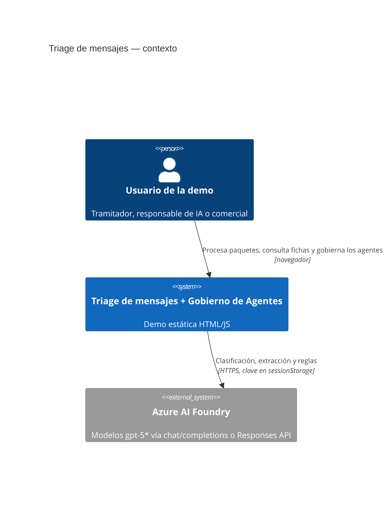
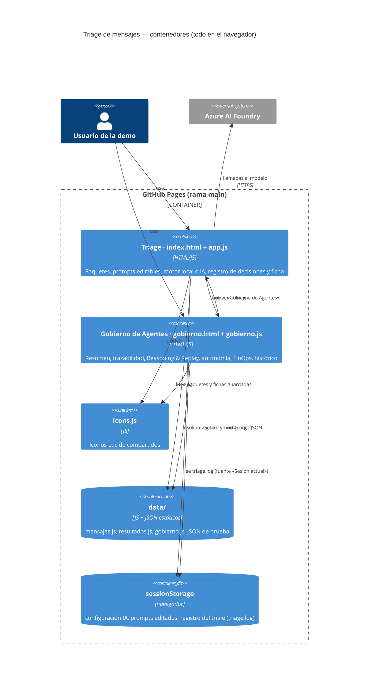
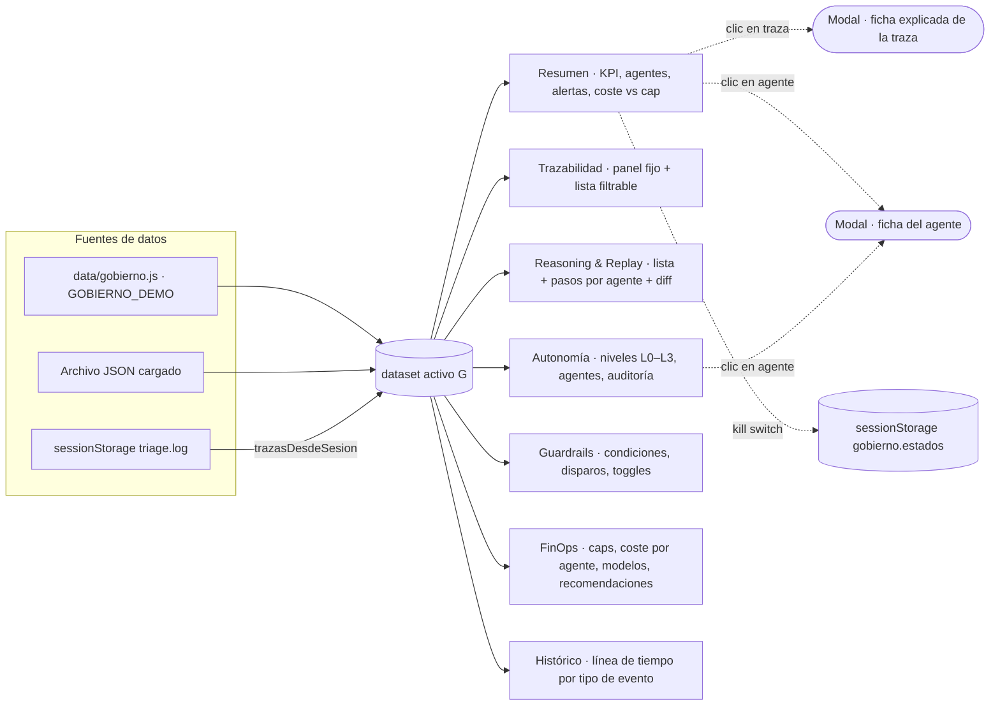

# Arquitectura (C4)

Demo estática servida por GitHub Pages: dos páginas HTML que comparten iconos y datos, sin backend. La única dependencia externa es Azure AI Foundry cuando el usuario configura una clave.

## Nivel 1 · Contexto

## Nivel 2 · Contenedores

## Nivel 3 · Componentes del panel de gobierno

Esquema del dataset (`data/gobierno-paquete-A.json`): `version`, `periodo`, `precios{modelo:{in,out}}`, `agentes[]` (con `historial[]`, `modelos[]`, `variables[]`), `niveles[]`, `politicas[]` (con `descripcion`, `severidad`, `disparos_dia[]`, `ultimos[]`), `cambios_autonomia[]`, `caps[]`, `kpis`, `alertas[]`, `modelos[]` (consumo, `coste_por_agente`, `exito`), `trazas[]` (cada una con `motivo` y `spans: [[agente, inicio_ms, duracion_ms, modelo, tok_in, tok_out, tok_reasoning]]`), `razonamiento{trazaId: pasos[]}`, `replays[]`, `diario[[fecha, mensajes, [€ por agente]]]`, `eventos[]`, `recomendaciones[]`.
